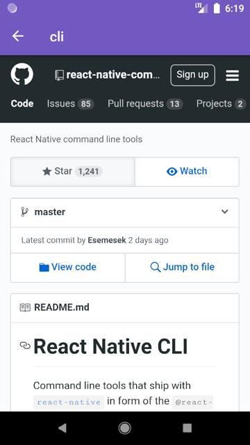

# 📱 React Native GitHub Users and their Starred Repos

<p align="center">
  
  
  
  
  
</p>

<h1 align="center">
  
  
  
</h1>

React Native app developed at RocketSeat that tracks GitHub users and their starred repositories from GitHub API.  
You can check the app here: https://appetize.io/app/y58uyzernxrwjaeu0b6k67mk6c

# Front end: React Native app

## Dependencies used

- "axios": "^0.19.2",
- "prop-types": "^15.7.2",
- "react": "16.11.0",
- "react-native": "0.62.2",
- "react-native-gesture-handler": "^1.6.1",
- "react-native-reanimated": "^1.8.0",
- "react-native-safe-area-context": "^0.7.3",
- "react-native-screens": "^2.4.0",
- "react-native-vector-icons": "^6.6.0",
- "react-native-webview": "^9.4.0",
- "reactotron-react-native": "^5.0.0",
- "styled-components": "^5.1.0"

## Getting started

1. Clone the project into your machine and install all dependencies inside the source folder using:

```console
yarn install
```

2. If you are using Android, run your emulator and run the command:

```console
react-native run-android
```

3. If you are using iOS, run your emulator and run the command:

```console
react-native run-ios
```

---

Made with ❤️ by Matheus Beck :wave: [Get in touch!](https://www.linkedin.com/in/matheus-beck/)

